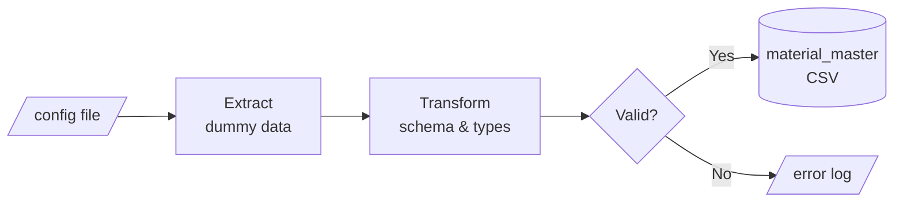

# CPG-LOGISTIC-DISTRIBUTION

## Overview
AI-Tacos is an emerging AI company based in Mexico. AI-Tacos sells profesional robots that prepare all kinds of tacos available across Mexico. The process is oil-free: you simply add the meat, corn for tortillas and vegetables, and the robot uses air-frying technology to produce delicious tacos.

After a period of rapid growth, AI-Tacos needed to build its data ecosystem from scratch. This project delivers that foundation: a centralized data platform on Azure + Databricks, real-time operational monitoring, executive KPI dashboards, and the analytical infrastructure needed to support a data science team.

## Bussines Requirements
AI-Tacos operates a B2B distribution model across multiple warehouses in Mexico.

The company recently equipped its fleet with two external data sources:
|System|Type|Description|
|--------|--------|--------|
|TrackTruck|Telemetry Platform + REST API|Provides real-time GPS location and truck event data|
|GPSVisit|Android App + REST API|Allows drivers to log completed client visits in the field|

#### Requirements
1. **Centralized Data Lake (Delta Lake)**  
Consolidate all data sources into a single, governed repository. The platform must be built on Azure and Databricks, as mandated by the company's technology stack decision.

2. **Real-Time Operational Monitoring** 
Build a web application that allows operations teams to track trucks and driver activity in near real-time, including visit logs captured through the GPSVisit mobile app.

3. **KPI Dashboard** 
In other application, deliver an executive dashboard tracking and visit. 
    - Completed service visits
    - Units sold (robots)
    - Revenue

4. **Advanced Analytics Layer** 
Support the company's newly hired data scientist by providing access to clean, curated, production-ready data. This includes surfacing operational patterns to support predictive and prescriptive analytics work.

 

# Simulator

## 1.1 Material master pipeline

Generates synthetic data for the material master catalog. Reads product definitions from a config file, applies schema validation, and persists the result as a dated CSV file.

---

### Extract

- Source: product catalog defined in `config`.
- Reads static dummy records — no external API call required.
- Each record maps to one row in the output schema.

### Transform

Apply schema simple transformation.

| Field | pandas type | Description |
|---|---|---|
| `product_id` | `string` | Unique product identifier. Format: `TRBT-{NNN}` |
| `sku` | `string` | Stock keeping unit. Format: `TRBT-{SLUG}` |
| `name` | `string` | Human-readable product name |
| `description` | `string` | Max 200 chars |
| `price` | `float64` | Unit price. Must be `> 0` |
| `currency` | `string` | ISO 4217 currency code (e.g. `USD`) |
| `weight_kg` | `float64` | Gross weight in kilograms |
| `dimensions_cm` | `string` | `WxDxH` in centimeters. |
| `is_active` | `boolean` | Whether product is active in catalog |

### Load

- **Output path:** `~/data/material_master/{DATE}_material_master.csv`
- `{DATE}` is substituted with the current date at runtime in `YYYYMMDD` format.
- **Example:** `~/data/material_master/20260629_material_master.csv`
- Format: CSV with header row, UTF-8 encoding.

---
